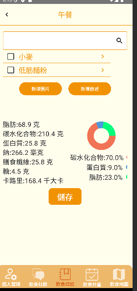

# pie chart
## value display on screen is not precise
For example, 

實際情況：

總計：68.9 + 210.4 + 25.8 = 305.1

| 比例 | 百分比 | 直接四捨五入到整數 |
|--------------------------------------------------
| 脂肪比例：68.9 / 305.1 = 0.2258275975090134  | 0.2258275975090134 * 100% = 22.58275975090134% | 23% |
| 碳水化合物比例：210.4 / 305.1 = 0.6896099639462471 | 0.6896099639462471 * 100% = 68.96099639462471% | 69% |
| 蛋白質比例 25.8 / 305.1 = 0.0845624385447394 | 0.0845624385447394 * 100% = 84.5624385447394% | 85% |